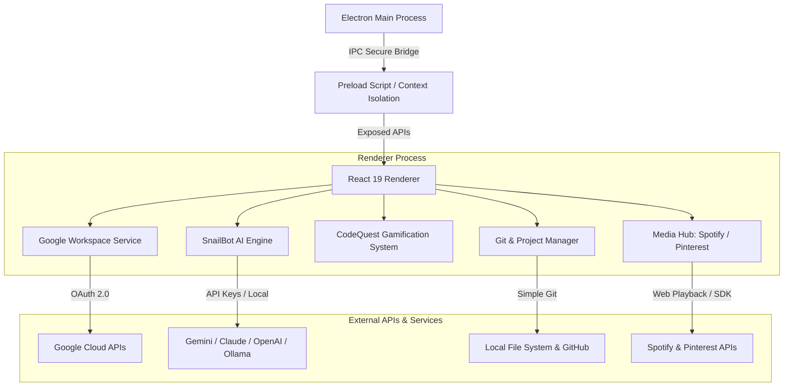

<p align="center">
  
</p>

<p align="center">
  
  
  
  
  
</p>

---

## What is epicSnail?

**epicSnail** è il **Desktop Productivity Hub Gamificato** di nuova generazione per sviluppatori e creator. Combina la gestione dei progetti locali, la sincronizzazione profonda con **Google Workspace**, un assistente **IA Multi-Provider (SnailBot)** contestuale, integrazioni multimediali (**Spotify, Pinterest, GitHub**) e un sistema di **Gamificazione CodeQuest** in un'unica interfaccia elegante in Dark Mode.

Costruito sulle fondamenta di **Electron 34**, **React 19**, **Vite 6** e **Tailwind CSS 4**, epicSnail offre un'esperienza utente reattiva, fluida e ad altissima resa estetica.

---

## Key Features

### 🔹 Google Workspace Master Hub
- **Login 1-Click Google OAuth**: Identità master sincronizzata con avatar, profilo e permessi trasparenti.
- **Google Tasks & Calendar Sync**: Visualizzazione dei task quotidiani e degli eventi in vista *Oggi* e nel *Calendario*, con spunta e aggiornamento in tempo reale.
- **Google Drive & Docs Preview**: Accesso istantaneo ai documenti di lavoro all'interno delle schede di progetto.

### 🤖 SnailBot IA — Multi-Provider Assistant
- **Supporto LLM Universale**: Collega in totale sicurezza Google Gemini, Anthropic Claude, OpenAI, DeepSeek o modelli locali via Ollama.
- **Context-Aware Assistance**: SnailBot legge in automatico gli eventi a calendario e i task quotidiani per rispondere in modo mirato alle priorità della giornata.
- **Secure Key Vault**: Gestione cifrata e locale delle chiavi API.

### 🎮 Gamification & CodeQuest
- **Sistema XP & Level Up**: Guadagna punti esperienza completando task, pushando commit ed eseguendo sessioni di lavoro.
- **CodeQuest Puzzle & Challenge**: Sfide di programmazione ed enigmi interattivi integrati per allenare la logica dev.
- **XP Pop Notification**: Reazioni visive ed effetti dinamici al raggiungimento dei milestone.

### 🎵 Media & Dev Integration Hub
- **GitHub Smart Deduplication**: Sync automatico delle repository Git locali con le corrispondenti remote GitHub, rilevamento branch attivo, ultimo commit e modifiche pendenti.
- **Spotify Smart Player**: Controllo riproduzione e playlist di sottofondo per le sessioni di deep work.
- **Pinterest Moodboard Grid**: Griglia visiva per bacheche e ispirazioni di design all'interno dei dettagli progetto.
- **Floating Sticky Notes**: Foglietti adesivi in overlay 3D espandibili e trascinabili per appunti al volo.

### 🎨 Aesthetic & Design System Vibe
- **Curated Dark Palette**: Canvas scuro (`#1e1333`), card tridimensionali (`#2b1c47`) e toni accento armoniosi (Lavender, Warm Sand, Sage, Blue Accent).
- **Strict Zero-Emoji UI**: Iconografia raffinata ed omogenea basata esclusivamente sui componenti vettoriali `AestheticIcons` e `BrandIcons`.
- **Global Command Palette**: Ricerca rapida globale via modale istantanea.

---

## Architecture Overview



---

## Tech Stack

| Categoria | Tecnologia | Versione | Descrizione |
| :--- | :--- | :--- | :--- |
| **Desktop Core** | **Electron** | `^34.3.0` | Framework desktop multipiattaforma con isolamento di contesto e IPC sicuro |
| **UI Framework** | **React** | `^19.0.0` | Frontend reattivo basato su componenti e custom hooks |
| **Build Tool** | **Vite** | `^6.2.0` | Dev server ultra-veloce ed HMR istantaneo |
| **Styling** | **Tailwind CSS** | `^4.3.3` | Engine grafico utility-first con custom design tokens |
| **Icons & Assets** | **Lucide & Custom SVG** | `^0.479.0` | Set icone vettoriali `AestheticIcons` e `BrandIcons` |
| **Git Integration** | **Simple Git** | `^3.27.0` | Rilevamento dello stato del repository in locale |
| **Effects** | **Canvas Confetti** | `^1.9.4` | Effetti grafici per notifiche di Level Up |

---

## Getting Started

### Prerequisiti
- **Node.js** v18+ e **npm** v9+
- Client Git installato sul sistema

### Installazione ed Avvio Locale

1. **Clona la repository**:
   ```bash
   git clone https://github.com/maryvellous/epicsnail.git
   cd epicsnail
   ```

2. **Installa le dipendenze**:
   ```bash
   npm install
   ```

3. **Avvia l'ambiente di sviluppo**:
   ```bash
   npm run dev
   ```
   *Questo script avvia simultaneamente il dev server di Vite ed il processo Electron.*

4. **Compilazione dell'eseguibile Windows**:
   ```bash
   npm run dist
   ```
   *L'installer `.exe` e la versione Portable saranno generati all'interno della cartella `dist-exe/`.*

---

## Project Structure

```text
epicsnail/
├── electron/                 # Processo Main Electron (main.js, IPC handlers, OAuth callback)
├── src/                      # Processo Renderer React
│   ├── assets/               # Asset grafici ed icone SVG
│   ├── components/           # Componenti UI (TodayView, ProjectsView, ChatPanel, CodeQuestView, ecc.)
│   ├── constants/            # Costanti di sistema e configurazioni
│   ├── context/              # Context Provider (Auth, Workspace, App State)
│   ├── data/                 # Data Layer e Mock Data per fallback
│   ├── hooks/                # Custom React Hooks
│   ├── utils/                # Helper e funzioni di utilità
│   ├── App.jsx               # Componente Root dell'applicazione
│   ├── index.css             # Design Tokens & Tailwind CSS Imports
│   └── main.jsx              # Entry point React
├── public/                   # Asset statici (banner.svg, icon.png, ecc.)
├── ROADMAP_PRODUZIONE.md     # Roadmap ufficiale per la release pubblica e il portfolio
├── package.json              # Dipendenze e script di build electron-builder
└── vite.config.mjs           # Configurazione bundler Vite
```

---

## Roadmap

Per consultare il piano di sviluppo aggiornato, la checklist pre-rilascio ed il percorso di preparazione della codebase a programma pubblico:

👉 **[Consulta ROADMAP_PRODUZIONE.md](file:///c:/Users/Clark/Desktop/Cosciottina/Nuova%20cartella/ROADMAP_PRODUZIONE.md)**

---

## Licenza

Questo progetto è rilasciato sotto licenza **MIT**. Consulta il file `LICENSE` per ulteriori informazioni.
