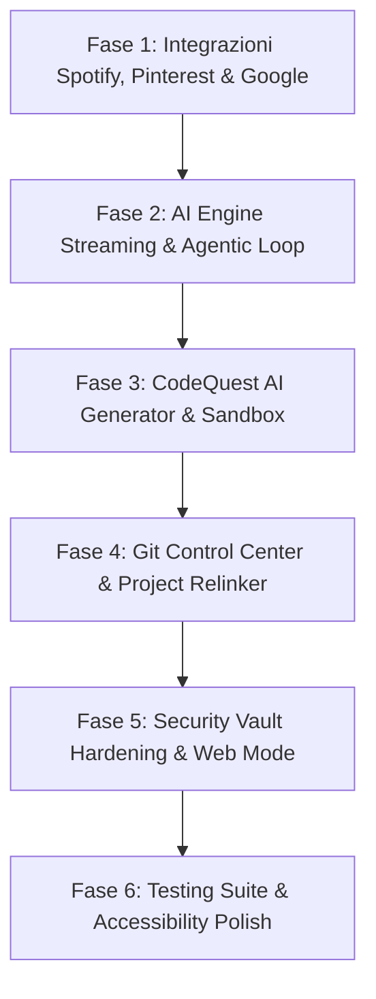

# Roadmap Ufficiale di Produzione — Diaspro Viboard (v2.0 Premium Edition)

> [!NOTE]
> Questa roadmap definisce le soluzioni definitive, le specifiche tecniche e l'architettura per trasformare **Diaspro Viboard** in una suite desktop di classe enterprise, ad altissima resa estetica e pronta per la produzione.

---

## 🎯 Visione & Obiettivi Principali
1. **Esperienza Utente Fluid-60fps**: Trasformare ogni widget, player ed interazione in un componente ultra-reattivo, alimentato da streaming in tempo reale e micro-animazioni armoniose.
2. **AI-First Engine**: Passare da chiamate sincrone a blocchi a un motore agentico ad alte prestazioni con streaming di token SSE, memoria a lungo termine e function calling multi-turn sicura con Human-in-the-Loop.
3. **Resilienza & Sicurezza Enterprise**: Cifratura Vault rafforzata, fallback trasparente tra ambiente Electron e Browser Web standalone, e completa gestione degli errori e casi limite.

---

## 📋 Moduli Roadmap (Punti da 1 a 6)

---

### Phase 1: Integrazioni Multimediali & API Terze Parti (Spotify, Pinterest, Google Workspace)

#### 1.1 Spotify Premium Web Player Upgrade
* **Frequenze Audio & Dynamic Visualizer**:
  * **Problema**: Le 21 barre dell'equalizzatore sono guidate da una semplice classe CSS `animate-pulse` statica.
  * **Soluzione Definitive**: Integrare l'algoritmo di sintesi delle frequenze basato sul tempo/BPM e progresso traccia per animare l'equalizzatore con altezze e colori HSL dinamici a 60fps durante il playback.
* **Smart Adaptive Polling & Live Scrubbing**:
  * **Problema**: Polling rigido e assenza di interattività sulla traccia.
  * **Soluzione Definitive**: 
    * Implementare l'endpoint IPC `spotifySeek(position_ms)` in [spotifyTools.js](file:///c:/Users/Clark/Desktop/Cosciottina/Nuova%20cartella/electron/spotifyTools.js) collegandolo ad una barra di avanzamento trascinabile (scrub bar) con anteprima oraria live.
    * Implementare lo Smart Adaptive Polling (1s in riproduzione, 5s in pausa, stop a player disconnesso) con interpolazione del tempo trascorso nel Renderer React.
* **Gestione trasparente Account Spotify Free vs Premium**:
  * **Problema**: Risposta 403 generica per utenti Spotify Free senza spiegazione in UI.
  * **Soluzione Definitive**: Intercettare lo stato del profilo e l'errore `403 Forbidden` nel backend Electron, mostrando un elegante card badge glassmorphism: *"Spotify Premium Richiesto per il controllo remoto diretto. Apri la traccia nell'app Spotify Desktop"*, con pulsante di avvio rapido tramite protocollo `spotify://`.

#### 1.2 Pinterest Moodboard & Infinite Visual Stream
* **Paginazione Cursore & Infinite Scroll**:
  * **Problema**: Limite fisso a 50 pin per bacheca.
  * **Soluzione Definitive**: Integrare la paginazione con token `bookmark` dell'API v5 Pinterest in [pinterestTools.js](file:///c:/Users/Clark/Desktop/Cosciottina/Nuova%20cartella/electron/pinterestTools.js), implementando l'Infinite Scroll con griglia Masonry virtualizzata e card skeleton animate durante i caricamenti.
* **Quick Inspiration & Local Moodboards**:
  * **Problema**: L'interfaccia è in sola lettura.
  * **Soluzione Definitive**: Consentire la creazione di bacheche locali o la memorizzazione rapida di card di ispirazione visiva legate specificamente ai progetti attivi in Diaspro Viboard.

#### 1.3 Google Workspace Master Hub (Calendar & Tasks)
* **Modal Avanzata Creazione & Edizione Eventi**:
  * **Problema**: Creazione eventi minimale con solo orario d'inizio.
  * **Soluzione Definitive**: Creare una modale premium in [GoogleCalendarWidget.jsx](file:///c:/Users/Clark/Desktop/Cosciottina/Nuova%20cartella/src/components/GoogleCalendarWidget.jsx) con selezione durata (15m, 30m, 1h, 2h, o custom), etichette colore Google Calendar, note in Markdown e ricorrenze rapide.
* **Quick Actions su Eventi e Tasks**:
  * **Soluzione Definitive**: Aggiungere pulsanti per eliminare, posticipare a domani ("Sposta a domani") e contrassegnare come completato in 1-Click con animazioni di scomputo XP per la gamificazione.

---

### Phase 2: Diaspro AI Engine & Architettura Agentica (Multi-Provider, Streaming & Function Calling)

#### 2.1 Server-Sent Events / Stream Realtime di Token
* **Problema**: Chiamate sincrone a blocchi che causano attese ed insicurezza visiva per risposte lunghe.
* **Soluzione Definitive**: 
  * Rifattorizzare `handleChatMessage` in [aiEngine.js](file:///c:/Users/Clark/Desktop/Cosciottina/Nuova%20cartella/electron/aiEngine.js) abilitando lo streaming nativo di token per tutti i provider supportati (Google Gemini Stream, OpenAI Chat Stream, Anthropic Messages Stream, Ollama Stream).
  * Inviare i chunk via `event.sender.send('ai-stream-chunk', { id, chunk })` a React, rendering token-per-token a 60fps con cursore animato in [ChatPanel.jsx](file:///c:/Users/Clark/Desktop/Cosciottina/Nuova%20cartella/src/components/ChatPanel.jsx).

#### 2.2 Smart Context Trimmer & Memory Summarizer
* **Problema**: Rischio di overflow del testo della chat sulle context window limitate.
* **Soluzione Definitive**:
  * Sviluppare una utility di conteggio e stimatore token (`tokenTrimmer.js`).
  * Mantenere invariato il System Prompt (Header contestuale), preservare gli ultimi 10 messaggi integri e sintetizzare automaticamente i messaggi più vecchi in un sommario compatto integrato nel contesto.

#### 2.3 Agentic Multi-Turn Loop & Interactive Human-in-the-Loop
* **Problema**: Esecuzione limitata ad un singolo passaggio per i tool chiamati dall'IA.
* **Soluzione Definitive**:
  * Implementare un ciclo iterativo di agentic function calling (fino a 5 passaggi automatici per tool di lettura).
  * Per i tool mutativi (creazione eventi, creazione issue GitHub, controlli player), generare direttamente nel flusso di chat una **Action Card Interactive** dove l'utente può rivedere i parametri ed approvare ("Conferma ed Esegui") o rifiutare l'operazione prima dell'effettiva esecuzione.

---

### Phase 3: Gamification & CodeQuest Engine (AI Puzzles & Safe Execution Sandbox)

#### 3.1 Procedural AI Code Quest Generator
* **Problema**: Set limitato di ~15-20 sfide cablate nel codice.
* **Soluzione Definitive**:
  * Integrare un generatore IA procedural in [CodeQuestView.jsx](file:///c:/Users/Clark/Desktop/Cosciottina/Nuova%20cartella/src/components/CodeQuestView.jsx) che attinge a Diaspro AI per forgiare enigmi e quiz di codice sempre nuovi, personalizzati per argomento (Python, JavaScript, SQL, Algoritmi, TypeScript).
  * Salvare una cronologia locale dei puzzle già risolti per evitare qualsiasi ripetizione.

#### 3.2 Safe Code Sandbox Runner
* **Problema**: Nessuna esecuzione reale dei frammenti di codice.
* **Soluzione Definitive**:
  * Implementare un runner isolato in Electron (`codeSandbox.js`) basato su Worker Threads/VM con timeout di sicurezza (max 2 secondi) e restrizioni sulle chiamate di sistema.
  * Fornire una vera console sviluppatore integrata nella card del puzzle con output `stdout`, `stderr` ed il valore di ritorno formattato.

#### 3.3 Streak System & Level Up Rewards
* **Soluzione Definitive**:
  * Sistema di contatore Streak (giorni consecutivi di lavoro/puzzle completati) con moltiplicatori XP (x1.5, x2.0).
  * Sblocco di badge ed etichette esclusive di livello utente ("Code Apprentice", "Master Architect", "Diaspro Legend").

---

### Phase 4: Gestione Progetti & Controllo Git Avanzato

#### 4.1 Git Control Center Integrato
* **Problema**: Scanner Git limitato al controllo base del branch.
* **Soluzione Definitive**:
  * Estendere [gitScanner.js](file:///c:/Users/Clark/Desktop/Cosciottina/Nuova%20cartella/electron/gitScanner.js) introducendo azioni di commit diretto con messaggio generato/suggerito da Diaspro AI, visione visiva dei file modificati (staging status), azioni 1-Click `Push to Remote`, `Pull` e switch immediato tra i branch locali.

#### 4.2 Auto-Relinker per Percorsi di Progetto Spostati
* **Problema**: Riferimenti e link a cartelle locali spezzati se i progetti vengono mossi su disco.
* **Soluzione Definitive**:
  * Algoritmo di verfica e ricerca euristica all'avvio dell'app. Se una cartella risulta inaccessibile, l'app cerca automaticamente percorsi simili o mostra una modale guidata "Riconnetti Cartella Progetto" senza perdere i dati ed i task associati.

#### 4.3 Tech Stack & Code Metrics Inspector
* **Soluzione Definitive**:
  * Scansione automatica dei file di configurazione (`package.json`, `requirements.txt`, `Cargo.toml`, ecc.) con rilevamento e visualizzazione di badge stilizzati per ciascuna tecnologia ed indicatore del numero complessivo di righe di codice per progetto.

---

### Phase 5: Sicurezza Vault & Fallback Universale Web

#### 5.1 Vault Cryptographic Hardening (PBKDF2 + Machine Salt)
* **Problema**: La chiave di cifratura di fallback in assenza di `safeStorage` di sistema usa stringhe di ambiente semplici.
* **Soluzione Definitive**:
  * Aggiornare [authVault.js](file:///c:/Users/Clark/Desktop/Cosciottina/Nuova%20cartella/electron/authVault.js) generandoun salt crittografico univoco per installazione (`machine-salt.bin`).
  * Derivare la chiave AES-256-GCM a 256 bit tramite `crypto.pbkdf2Sync` (100.000 iterazioni HMAC-SHA256) legata all'ID hardware unico della macchina.

#### 5.2 Standalone Web App Bridge & Storage Sync
* **Problema**: In modalità browser Web senza Electron, l'app ricorre a dati demo finti senza permettere l'uso diretto delle API dell'utente.
* **Soluzione Definitive**:
  * Sviluppare `webStorageAdapter.js` che intercetta le chiamate quando `window.electronAPI` è assente, consentendo all'utente di inserire le proprie API Key direttamente nelle Impostazioni Web, salvandole cifrate in `localStorage` ed abilitando il funzionamento completo dell'app anche sul web.

---

### Phase 6: Infrastruttura, Testing & Accessibilità (a11y)

#### 6.1 Testing Suite & Automated Pipeline
* **Soluzione Definitive**:
  * Installare e configurare **Vitest** in [package.json](file:///c:/Users/Clark/Desktop/Cosciottina/Nuova%20cartella/package.json) per coprire con test unitari le utility di data formatting, l'algoritmo di gamification, l'architettura dei contesti React e i gestori delle chiavi del vault.
  * Aggiungere uno script di verifica della build e linter ESLint con regole specifiche per React 19 ed Electron IPC.

#### 6.2 Global Command Shortcuts & Accessibility Polish
* **Soluzione Definitive**:
  * Registrare gestori da tastiera globali: `Ctrl+K` / `Cmd+K` per l'apertura istantanea della Command Palette (`QuickSearchModal`), `Ctrl+Shift+P` per la commutazione veloce del Provider IA, ed il tasto `Esc` per la chiusura uniforme di qualsiasi modale.
  * Implementare un Focus Trapping rigoroso ed i tag ARIA (`aria-modal`, `aria-expanded`, `role="dialog"`) per la piena conformità ed accessibilità con screen reader.

---

## 📅 Piano di Esecuzione & Fasi Consigliate

---

## 🛑 Prossimi Passi

1. **Revisione Utente**: Verificare la roadmap ed approvare le specifiche tecniche sopra descritte.
2. **Autorizzazione Esecuzione**: Una volta confermata, procederemo all'implementazione sequenziale delle Fasi (dalla Fase 1 alla Fase 6) aggiornando direttamente il codice sorgente del progetto.
